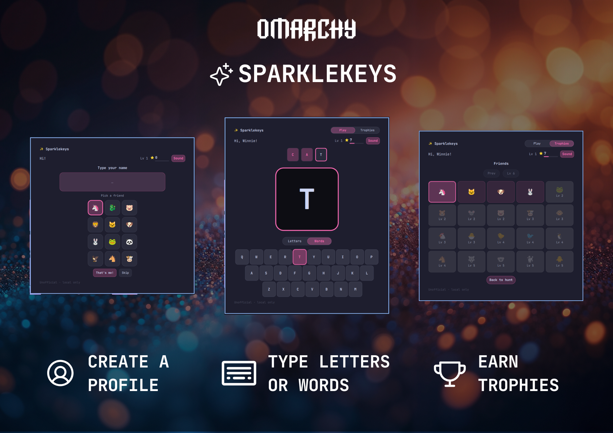

# Sparklekeys



Letter Hunt for a first keyboard. Type, earn trophies.

**ID:** `kenhara.sparklekeys`  
**Author:** Harris Kenny  
**License:** MIT  
**Version:** 1.0.2

**Repo:** https://github.com/kenhara/omarchy-sparklekeys

**Marketplace (not listed yet):** this is the v1 listing. Filing now as category **Kids**, tags `education` and `kids`. Listed when HANCORE publishes.


### 1.0.2

- Resubmission for marketplace review #4406. Resolves the four
  filesystem-boundary findings from that review, all in
  `scripts/progress.py` + `SparkleStore.qml`:
  1. Path creation walks `$HOME → data-home → sparklekeys` with retained
     `O_DIRECTORY|O_NOFOLLOW` dirfds; dirs are made with `mkdir(dir_fd=)`
     and tightened with `fchmod(fd)` — never `makedirs`/`chmod` on a
     pathname (kills symlink redirection).
  2. `read_cache()` validates every ancestor via the NOFOLLOW dirfd walk,
     not just the leaf pathname.
  3. Atomic write adds a fail-closed directory `fsync` after `renameat`.
  4. The QML `progressReadProc` runs under `/usr/bin/timeout
     --kill-after=2s 8s …` plus a 10s read deadline that falls back to
     defaults — no hang path.
- `scripts/prove-progress.sh` proves each of the above (leaf/dir symlink
  refusal, FIFO no-hang, oversize rejection, path validation, trusted-dir
  enforcement, stdin-only, write round-trip). See `SECURITY-FIXES-4406.md`
  for the finding→fix→proof map.
- Version sync: manifest / README / DESIGN all read 1.0.2 (the 1.0.1
  hardening commit had bumped only the manifest). No gameplay change.

### 1.0.0

- Marketplace `preview.png` is a live collage (profile, hunt, trophies).
- Filing as category **Kids**, tags `education` and `kids`. In-shell
  `barWidget.category` stays Widgets.
- LICENSE is a stock MIT header so marketplace detect can read it
  (Kenney CC0 credit stays in `sounds/ATTRIBUTION.txt`).
- Card description: Kids letter hunt for a first keyboard. Type, earn
  trophies.

### 0.9.0

- Trophy inspect is a full Trophies panel (giant emoji, title, blurb), not
  an overlay card. Back (or tap the emoji) returns to the same board.
  Play | Trophies header stays; inspect is not a third room tab.
- Completing a level plays `sounds/level.wav` (Kenney confirmation_003)
  instead of the letter-hit coin. Miss stays silent. Sound toggle still
  gates it.
- Stars per level 20 (was 15). Letter still +1 (overlay stays). No streak
  extra. Word complete +5 extra. Daily +5 stays. Header level remains
  uncapped. `schemaVersion` 4 rescales old `totalEarned` / `stars` by
  `floor(n * 20 / 15)` so displayed level does not drop.
- Four more 4×5 boards: Ocean (Lv 21–25), Treats (26–30), Wheels (31–35),
  Party (36–40). Trophy cap 40. Existing Friends / Garden / Sky / Wild
  unchanged.
- Progress write is helper stdin (not argv `--data`). `--file` paths run
  `is_safe_config_path` on read and write. Isolated `/tmp` prove in
  `scripts/prove-progress.sh`.

### 0.8.0

- Progress I/O through `scripts/progress.py` (HC-05 read + exclusive write).
  No FileView. Helper `mkdir` 0700; exclusive tmp, fsync, `os.replace`.
- Cut leftover chrome: unused CharacterView, Trophies lede, extra
  `keep practicing` under Next (dim Next already says `Lv N`), Play
  `Type the word` caption. Locked inspect keeps `Lv N`.

### 0.7.0

- First open: type a name **and** pick an avatar from a 3×4 of twelve
  animals (unicorn pre-selected): unicorn, dragon, pig, lion, cat, dog,
  bunny, frog, panda, eagle, horse, cow. That's me! wears it on the bar
  chip even if that trophy is still locked. Eagle is first-run only (not a
  board trophy). Skip: no name, bar stays ✨, and that choice is saved so
  the name screen does not return. Existing `progress.json` users do not
  see the name screen again. Greeting example stays Jane.

### 0.6.0

- Primary mark is ✨: header glyph and default bar wear (`selectedFriend`
  `sparkles`). Unicorn stays a Friends-board trophy and the default
  `characterPack`. Sparkles is identity-only — not a Sky tile (that would be
  gray on Sky while worn on the bar). Sky's old sparkles slot is fireworks 🎆
  (`id: fireworks`).
- Tap any trophy (locked or unlocked) to inspect: huge emoji, title, and a
  short kid-simple blurb. Unlocked inspect also wears it on the bar. Locked
  stays gray and shows `Lv N` / keep practicing. Close via scrim or Close.
  Greeting example stays Jane.
- +1 ⭐ award flash (and streak / word / daily variants) overlays the letter
  so the keyboard does not jump.
- Word Mode picks from a pack **tier every 10 levels** (many short words,
  still no Shift). Displayed level is uncapped (`1 + floor(totalEarned / 15)`,
  header can show Lv 21+). Trophy boards and unlocks still cap at 20; after
  that Trophies stay complete.

### 0.5.0

- Room is **Trophies** (header Play | Trophies). Play stays hunt-only.
  Greeting stays on its own line. Flickable scroll stays.
- Each board is a 4×5 grid (20 trophies). Four trophies unlock per level
  (`level = 1 + floor(totalEarned / 15)`, cap 20). Opening Trophies (and
  leveling up while that room is open) loads the board for her current
  level. Prev/Next still browse unlocked boards; Next stays dim until the
  next board unlocks.
- Locked tiles: stone-gray background, emoji at low opacity, `Lv N`.
  Unlocked: full color, accent-tinted tile; tap to wear on the bar chip.
  Kid reads the picture (emoji-only; names dropped so 20 tiles fit).
- Boards: Friends (Lv 1–5), Garden (6–10), Sky (11–15), Wild (16–20).
  Default selected trophy is unicorn.

### 0.4.0

- Play stays hunt-only. Closet is now the Friends room: four themed emoji
  boards (Friends, Garden, Sky, Wild). One friend unlocks per level.
- Tap an unlocked friend to wear it on the bar chip. Next pages to the
  next board once it is unlocked; locked next is dim (`keep practicing` /
  `Lv 6`).
- Greeting sits on its own line under the title so `Hi, Jane!` never
  clips. Friends room (and Play) scroll inside a Flickable when the panel
  is clamped.
- Bar chip is the selected emoji (plus optional star count). No Phosphor
  overlay, hat, or horn.

### 0.3.0

- Play is hunt-only: the target letter and the on-screen keyboard. Closet is
  the dressing room. The bar chip is the character during a lesson.
- One quiet Play | Closet pair in the header. Sound stays by the stars.
  Letters|Words stays under the letter on Play. No tap-the-unicorn to switch.
- Closet hero is a large CharacterView (top-center) with Look / Hat / Friend
  under it and a Back to hunt pill. Name-entry is a centered field.

### 0.2.1

- Unicorn horn (Shape on the Phosphor horse), idle sparkles, punchier correct-key burst. Panel hugs the keyboard. Sound sits by the stars; Letters|Words by the letter; tap the unicorn for the Closet.

### 0.2.0

- Phosphor character, hats, and friends (local Shape/Path, tintable). Closet
  purchases show on the character in Play and on the bar chip.
- Closet is Look / Hat / Friend only. No kid-facing Effects or Banners.
- Levels from total stars earned (`Lv N`, cap 20). Buying does not de-level.
- Letters | Words sliding switch on Play (not a third tab).
- Greeting is not a tap-to-rename control. First-open name flow stays.
- One play room: slim product header, companion + giant letter on a stage,
  keyboard as the floor. Closet keeps a live preview on the left.
- Cartoon sounds (Kenney Interface Sounds, CC0) bundled as
  `sounds/hit.wav` / `sounds/sparkle.wav`. In-panel Sound toggle; default ON.
  Misses stay silent.

### 0.1.0

- Letter Hunt (big target + on-screen keyboard hint). Wrong key wiggles; no
  penalty; Shift never required.
- Word Mode (schema `startMode`) using the active pack's short words.
- Stars: +1 per letter, +2 every 5-streak, +5 at the daily goal.
- Closet spends stars on pack cosmetics.
- Child types their name in-panel (first exercise). Greeting becomes `Hi, Name!`.
- Unicorn pack + dragon stub. `characterPack` swaps the whole world.
- Progress at `~/.local/share/sparklekeys/progress.json` (not cache).
- Pure QML. No Python, no network. (0.1 snapshot; 0.8 added local `progress.py`. Still no network.)

## Discoverability

Marketplace filing: category **Kids** · tags `education, kids`. In-shell
`barWidget.category` stays **Widgets** for the Omarchy loader (allowlist;
not the marketplace form). Display name stays **Sparklekeys**.

Directory search at plugins.omarchy.org uses `manifest.description` plus
filing tags. Top-level `keywords` and `barWidget.aliases` are not the
catalog haystack.

## Install

### From GitHub

```sh
omarchy plugin add https://github.com/kenhara/omarchy-sparklekeys.git --enable
omarchy bar move kenhara.sparklekeys --section right
```

### Local copy (this tree)

The **git repo root is the plugin** (`manifest.json` at root). On an Omarchy
machine:

```sh
mkdir -p ~/.config/omarchy/plugins
cp -a . ~/.config/omarchy/plugins/kenhara.sparklekeys

omarchy plugin validate ~/.config/omarchy/plugins/kenhara.sparklekeys
omarchy-shell shell rescanPlugins
omarchy plugin enable kenhara.sparklekeys
omarchy bar move kenhara.sparklekeys --section right
```

Hot reload applies on save under `~/.config/omarchy/plugins/`.

### Symlink (dev)

On the Omarchy machine (Latitude / UTM / the box that runs `omarchy-shell`):

```sh
mkdir -p ~/.config/omarchy/plugins
ln -sfn /path/to/omarchy-sparklekeys ~/.config/omarchy/plugins/kenhara.sparklekeys
omarchy plugin validate ~/.config/omarchy/plugins/kenhara.sparklekeys
omarchy-shell shell rescanPlugins
omarchy plugin enable kenhara.sparklekeys
omarchy bar move kenhara.sparklekeys --section right
```

Saving any file under the symlink hot-reloads the plugin.

Optional pre-flight if `qmllint` and `$OMARCHY_PATH` are available:

```sh
qmllint -I "$OMARCHY_PATH/shell" *.qml
```

## Play

1. **Left-click** the bar emoji (optional star count) to open the panel.
   That chip is who she is — the selected trophy lives there during a lesson.
2. First open: type a name (letters only), pick a friend from the 3×4
   (unicorn is already selected), and tap **That's me!** — or **Skip**
   (no name, bar stays ✨; Skip is saved so the name screen does not return).
3. Hunt the big letter. The matching key glows on the hint keyboard. Play is
   the hunt only.
4. Right key → stars + celebration + next letter. Wrong key → wiggle + brighter
   glow. No timers, no game over, no score loss.
5. Tap **Trophies** in the header to open the board for her current level.
   Tap a trophy to inspect it: the board hides and a full Trophies panel
   shows a giant emoji, title, and blurb. Unlocked inspect also wears it
   on the bar chip. Locked tiles stay gray with `Lv N` and still show their
   name and blurb (they do not wear). **Back** (or tap the emoji) returns to the same board.
   **Next** pages to the next themed board once it is unlocked; otherwise
   it stays dim (`Lv N`). **Back to hunt** returns to Play.
6. Escape or click-away closes. Progress survives a shell restart.

Letter order starts with the letters of the child's name (when set), then a
curated easy cycle.

Level is `1 + floor(totalEarned / 20)` (header uncapped). Four trophies
unlock per level through 40; boards stay complete after that (Play board).
Trophies are not bought with stars. Words mode uses the active pack's tier
for her current level.

### Controls

| Input | Action |
|-------|--------|
| Left-click bar | Toggle panel |
| Escape | Close panel |
| Letter keys | Hunt / type (case-insensitive) |
| Play / Trophies (header) | Switch hunt ↔ trophy boards |
| Back to hunt (Trophies) | Return to the hunt |
| Prev / Next (Trophies) | Page boards (Next only when unlocked) |
| Trophy tile | Inspect (wear if unlocked) |
| Inspect Back / tap emoji | Return to the same trophy board |
| Letters / Words switch (under the letter, Play only) | Toggle start mode (mirrors `startMode`) |
| Sound pill (by stars) | Toggle cartoon hit / sparkle / level-up |
| Name: Enter | Save name + avatar (first-open flow) |
| Name: Backspace | Delete a letter |

## Configure

Parent-facing knobs. Child name, stars, selected trophy, and stats live in
`progress.json`, not `shell.json`.

| Schema key | Type | Default | Purpose |
|------------|------|---------|---------|
| `characterPack` | enum `unicorn` `dragon` | `unicorn` | Practice words / theme accents |
| `letterCase` | enum `upper` `lower` | `upper` | How targets are shown |
| `startMode` | enum `letters` `words` | `letters` | Letter Hunt or Word Mode |
| `dailyGoal` | integer 5–200 | `20` | Correct letters/day for the +5 bonus |
| `showStarsOnBar` | boolean | `true` | Star count next to the emoji on the bar chip |
| `soundEnabled` | boolean | `true` | Cartoon hit / sparkle (in-panel toggle) |

```sh
omarchy bar set kenhara.sparklekeys characterPack dragon
omarchy bar set kenhara.sparklekeys letterCase lower
omarchy bar set kenhara.sparklekeys startMode words
omarchy bar set kenhara.sparklekeys dailyGoal 20
omarchy bar set kenhara.sparklekeys showStarsOnBar true
omarchy bar set kenhara.sparklekeys soundEnabled true
```

Pack-swap proof: `characterPack dragon` switches practice-word tiers and accent
colors with **zero logic changes**. Trophies boards are shared, not per-pack.

## Remove

```sh
omarchy plugin remove kenhara.sparklekeys
```

Optional progress cleanup (this **deletes earned stars**):

```sh
rm -rf ~/.local/share/sparklekeys
```

## Sound

Three tiny Kenney **Interface Sounds** clips (CC0) live in `sounds/`:

| File | When | Source clip |
|------|------|-------------|
| `hit.wav` | Correct letter | `confirmation_001.ogg` |
| `sparkle.wav` | Word complete, daily goal, special burst | `confirmation_002.ogg` |
| `level.wav` | Level-up (instead of the letter-hit coin) | `confirmation_003.ogg` |

Played with QtMultimedia `SoundEffect` via `Qt.resolvedUrl("sounds/hit.wav")`
(plugin-local only). Volume is modest (~0.5). A miss is silence — no-fail.
Toggle **Sound** in the panel (filled = on, outline = off). No extra package.
No freedesktop theme chimes. Credit: [Kenney.nl](https://kenney.nl/assets/interface-sounds)
— see `sounds/ATTRIBUTION.txt`.

## Data

- **Progress:** `${XDG_DATA_HOME:-$HOME/.local/share}/sparklekeys/progress.json`
  Read/write via `scripts/progress.py` (HC-05: `O_NOFOLLOW` regular file,
  cap 64 KiB; exclusive tmp 0600 + fsync + `os.replace`). Write payload is
  stdin only (not argv `--data`). `--file` must be an absolute local path
  (`is_safe_config_path`) on both read and write. Helper creates the data
  dir `0700`. Missing or corrupt file seeds a working default game.
  `schemaVersion` 4 stores `selectedFriend` (unknown ids fall back to
  sparkles). Files older than 4 rescale `totalEarned` and `stars` by
  `floor(n * 20 / 15)` so displayed level matches the old 15-star steps.
  Hydrate strips `<>` / markdown images / ASCII controls on persisted
  strings before they hit Text. Trophies snaps to the current-level board
  on enter. Old stars / name / stats still hydrate. Old closet unlock keys
  are ignored for play but not wiped.
- **Why not `~/.cache`:** this is earned progress. A cache cleaner must not
  wipe her stars. Intentional divergence from sibling plugins.
- **No network.** Local Python helper only (progress I/O). No clipboard or
  `xdg-open` helpers. No sudo.

## Layout

```
manifest.json       # kenhara.sparklekeys @ 1.0.2
qmldir
BarWidget.qml       # bar chip (selected emoji) + Loader → Panel; owns SparkleStore
Panel.qml           # KeyboardPanel + two-line header (Play|Trophies, greeting, Sound)
SparkleStore.qml    # state, economy, Process → scripts/progress.py, SoundEffect
PackLibrary.qml     # unicorn + dragon 4-tier words; identity ✨; 12-avatar catalog; eight 4×5 boards (cap 40)
PlayView.qml
ClosetView.qml      # Trophies room (4×5 boards + inspect subpanel)
KeyboardHint.qml
Celebration.qml
StarCounter.qml
scripts/progress.py # HC-05 read + exclusive stdin write for progress.json
scripts/prove-progress.sh  # isolated /tmp prove (never real progress)
sounds/             # Kenney CC0 hit.wav + sparkle.wav + level.wav
DESIGN.md
REPO.md
LICENSE
README.md
```

`PhosphorIcon.qml` stays for Celebration burst glyphs. Do not load it from
Panel / Bar / Trophies.

## Security baseline

- No API keys. No outbound network.
- Disk: one progress file under `~/.local/share/sparklekeys/` (dir 0700,
  via `scripts/progress.py`).
- Child name is letters-only, length-capped, shown as `Text.PlainText`.
- MIT at repo root. Phosphor regular glyphs bundled locally (MIT) for
  celebration bursts only.
- Three Kenney Interface Sounds clips (CC0) under `sounds/`. No remote audio.
- No remote Image / SVG. No CI / GitHub Actions.

## License

MIT — see [LICENSE](LICENSE). Phosphor Icons path data is MIT
(https://phosphoricons.com).
